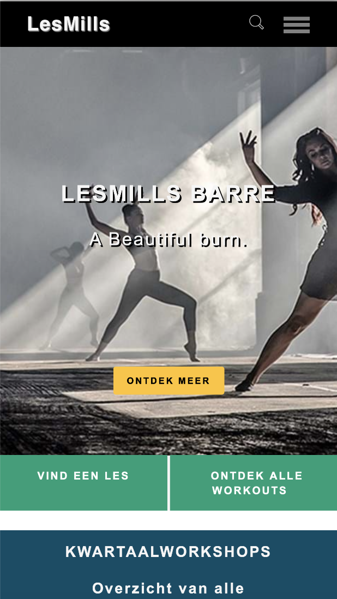
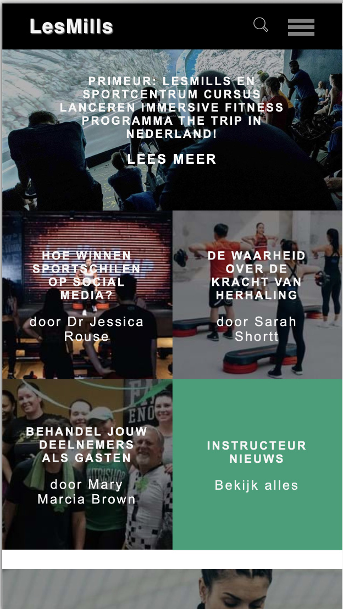
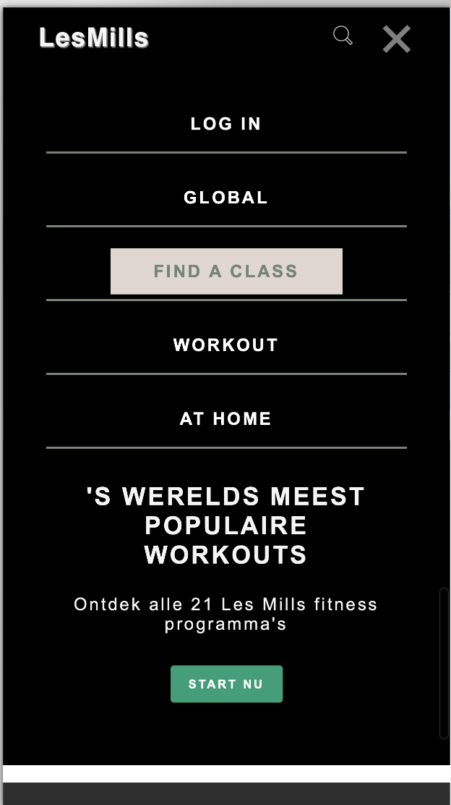
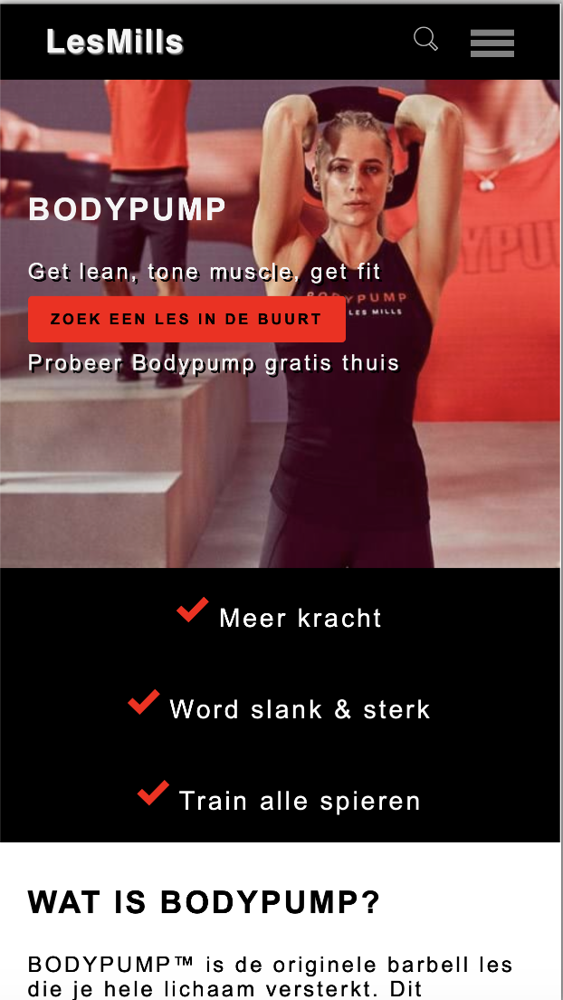
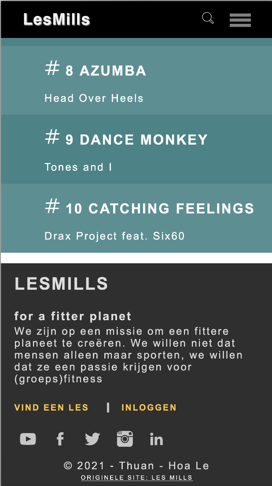
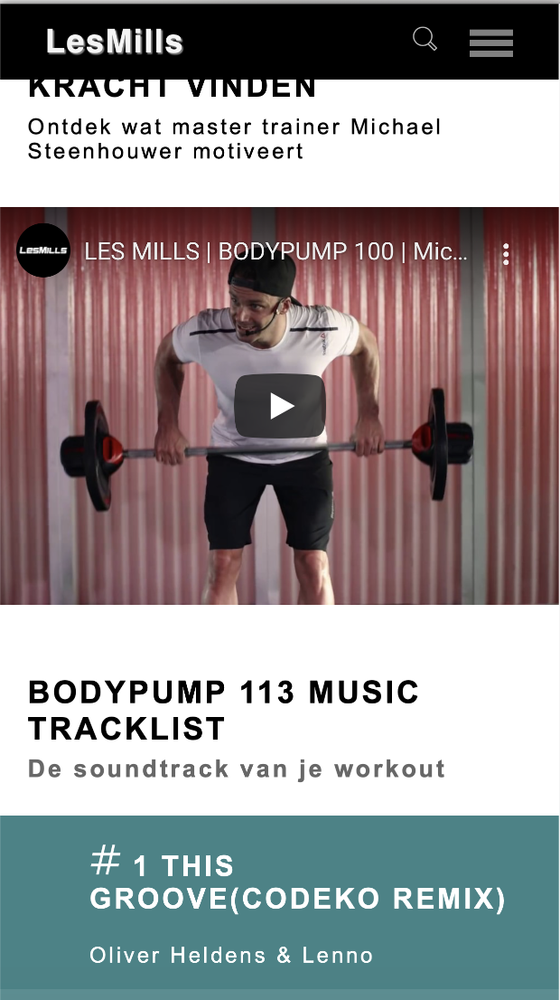
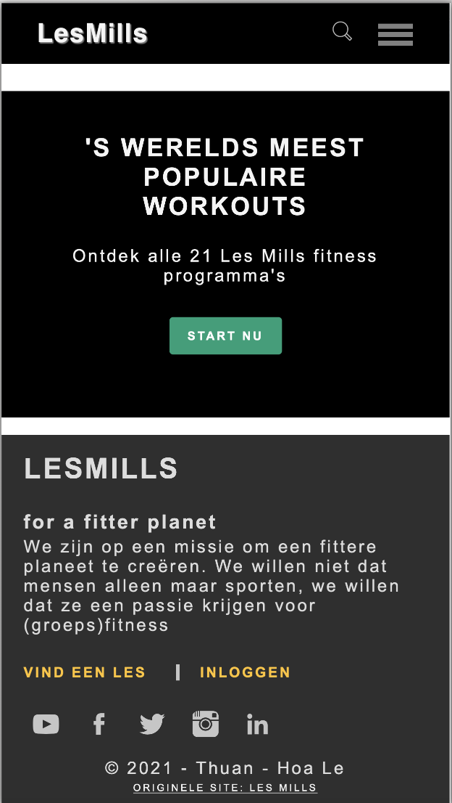
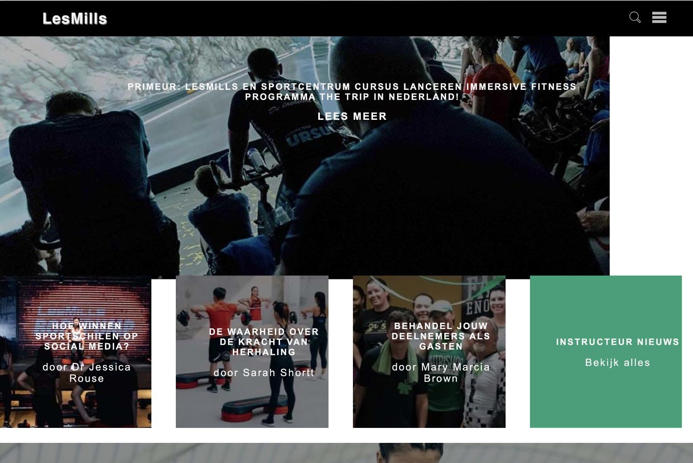
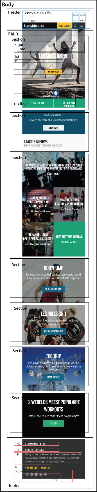

# Procesverslag
**Auteur:** Thuan-Hoa Le

Markdown cheat cheet: [Hulp bij het schrijven van Markdown](https://github.com/adam-p/markdown-here/wiki/Markdown-Cheatsheet). Nb. de standaardstructuur en de spartaanse opmaak zijn helemaal prima. Het gaat om de inhoud van je procesverslag. Besteedt de tijd voor pracht en praal aan je website.

## Bronnenlijst
1. bron 1 eerste pagina: https://www.lesmills.com/nl
2. bron 2 tweede pagina: https://www.lesmills.com/nl/workouts/fitness-lessen/bodypump/
3. bron 3: elementen verbergen: https://www.a11yproject.com/posts/2013-01-11-how-to-hide-content/
4. bron 4: https://css-tricks.com/absolute-relative-fixed-positioining-how-do-they-differ/
5. bron: 5 hamburger menu: https://www.youtube.com/watch?v=gXkqy0b4M5g
6. bron 6 - SVG icons: https://iconmonstr.com

## Eindgesprek (week 7/8)
1. Dit ging goed:
* Website zo veel mogelijk responsive te krijgen door gebruik te maken van grid-template.
*hamburger menu animeren en menu laten zien.
* Toevoegen van een youtube video
* In CSS, het aanroepen van elementen.

2.dit was lastig:
* Helaas, had ik het erg druk in de tentamen week. Waardoor ik niet veel aan front-end kon zitten.
* Navigatie menu responsive maken, helaas niet gelukt.
* Website responsive maken, deels is het gelukt

-screenshot(s) van je eindresultaat-
* Home pagina:

* Pagina 2:

* footer met SVG icons

## Voortgang 3 (week 6)

1. Dit ging goed:
* Grid area voor mobiel formaat is gelukt.
* elementsen op de juiste manier "hidden" maken.

2. Dit was lastig:
* SVG iconen plaatsen lukt nog niet en snap er vrij weinig van.
* Grid area voor website formaat niet gelukt om het "responsive" te krijgen.
* nog niet de juiste fonts kunnen vinden.

## Voortgang 2 (week 5)

-Voortgang 2-
In week 5 heb ik de "Github problemen opgelost". Dit waren Footer, heaading structuur en percentage aanpassen op elementen.

## Voortgang 1 (week 3)

### Stand van zaken

1. Dit ging goed:
* De structuur van "Index.html" controleer ik iedere week of het nog semantiek correct is.
* Het is gelukt om de navigatiemenu en foto's in de content op de homepagina te krijgen.
* BreakDown Schets & readme Updaten

1. Dit was lastig:
* Positionering van elementen op een foto vond ik lastig.

**Screenshot(s):**

-screenshot(s) van hoe ver je bent met korte uitleg-
* Ik was nog niet heel ver met de eind opdracht, waardoor ik alleen de homepagina heb.

### Agenda voor meeting

Samen met je groepje opstellen

| Thuan-Hoa      | Raekwon            | Marjolein    | Nazier           |
| ---            | ---                | ---          | ---              |
| Positionering van elementen op een image, nav fixed?, grid in een article?| en dit             | en ik dit    | en dan ik dat    |
| an dat ook nog | dit als er tijd is | nog een punt | dit wil ik zeker |
| ...            | ...                | ...          | ...              |

### Verslag van meeting

Meeting: 1 -
1. vragen gesteld waar ik niet uitkwam.
2. Na afloop van de les, heb ik gelijk de feedback verwerkt. Namelijk de navigation vast zetten en text op een image.

## Breakdownschets (week 1)
Uitwerken voor de 1e werkgroep:

Eind van de eerste week.

## Intake (week 1)
-uitwerken voor de kick-off werkgroep - begin van de eerste week-

**Je startniveau:** -kies uit zwart, rood óf blauw-

Mijn start niveau: Rood

**Je focus:** -kies uit responsive óf surface plane-

Voor deze opdracht ga ik me focussen op responsive.

**Je opdracht:** -link naar de website die je gaat namaken óf de naam van je eigen ontwerp-

De website link: https://www.lesmills.com/nl

**Screenshot(s) van de eerste pagina (small screen):**

bron: https://www.lesmills.com/nl/

**Screenshot(s) van de tweede pagina (small screen):**

bron: https://www.lesmills.com/nl/workouts/fitness-lessen/bodypump/
